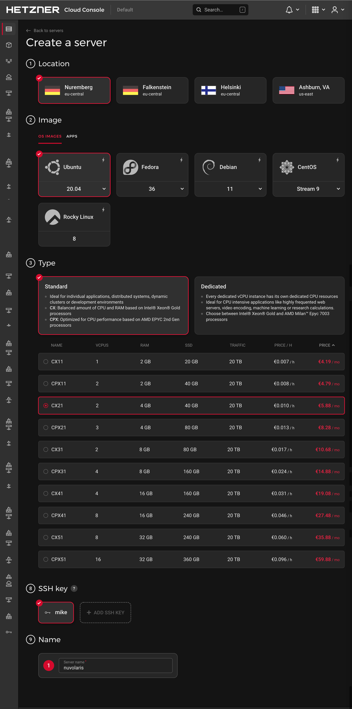

# Install on an Hetzner Cloud single instance

You can install Nuvolaris on a single Hetzner Cloud instance.

You need at least 4GB, 30GB disk space and 2 VCPU.

As a prerequisite, you need to get access to the [Hetzner Cloud Console](https://console.hetzner.cloud/projects) by registering to Hetzner.

Before starting you need also to:

- create a new project
- enter in the project and create an ssh key

Once you got access to the console and performed the steps before, use the following instructions to lauch a suitable virtual machine and install Nuvolaris in it.

## Launch an Hetzner Virtual Machine



1. Select your preferred location.
2. Select Ubuntu 20+ as a distribution.
3. Select standard or Dedicated for better performance
4. Use the default.
5. Use the default.
6. Use the default.
7. Use the default.
8. Select your ssh key here and download it.
9. Give it a name, for example `nuvolaris``

You are ready. Click on _Create and Buy Now_.

After the creation it will show the `<ip-address>` of your machine.

Access the machine with:

```
ssh -i <key-file> root@<ip-address>
```

## Install Nuvolaris

Once you are connected to the virtual machine with ssh, you can install Nuvolaris executing:

```
curl -s https://www.nuvolaris.io/scripts/ubuntu.sh | bash
```

The script will take a while to install Kubernetes and Nuvolaris.

If something goes wrong, please check the [troubleshooting](troubleshooting) page.

At the end it will show a command like this:

```
nuv wskprops --apihost=<apihost> --auth=<auth>
```

where `<apihost>` is the DNS name of your virtual machine and `<auth>` is the authorization key.

Take note of this command. You will need it to configure access to your serverless environemnt from anywhere using this command.

You can then install the `nuv` command in your favorite client machine, [downloading](/download) the correct version and use the command before to connect to your instance.

Once the installation is completed, proceed reading [Apache OpenWhisk documentation](https://openwhisk.apache.org/documentation.html), remembering to use `nuv wsk` when you see `wsk`.
